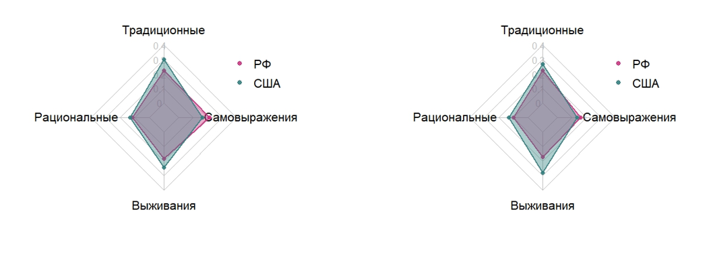

**Description**: In this study, two large language models were trained: one on a corpus of American newspaper publications and the other on a corpus of Russian newspaper publications. Newspaper publications from 2015 to 2019 were used in this study; the resulting models reflect only events and features that occurred during these years. The study compares the vector representations of the selected terms using the cosine measure. The results obtained from these models are compared, as well as with estimates obtained using Inglehart's Wave 7 cultural values ​​map.

Data

This work utilized two data corpora available for non-commercial use.

1. A corpus of publications from American English-language newspapers. A. Thompson's "All the News 2.0" corpus was used as a base, containing publications from leading American newspapers from 2016 to 2020. Publications from 2020 were removed, publications from 2015 from the "All the News" source were added, newspapers with low trust levels, such as "Buzzfeed," were removed, and publications devoted to narrow topics, such as "Refinery 29," were also removed. Only publications from 2015 to 2019 were retained in the corpus for training the model. A total of 1 million publications were selected for training the model.

2. A corpus of publications from Russian newspapers in Russian was formed based on I. Gusev's corpus. Some publications from ria.ru and lenta.ru were also added. Only publications from 2015–2019 were retained in the corpus for model training. A total of 1 million publications were selected for model training.

Method

Separate models were trained from scratch for texts from each of the available corpora. According to the training procedure, words from the corpus are tokenized and vectorized. Vectors representing words are called embeddings or vector representations. According to the distributional hypothesis, two linguistic units occurring in similar contexts tend to be close to each other in the model's vector space, and the distances between their corresponding vector representations reflect a measure of their semantic similarity.
The cosine similarity measure is used as a measure of similarity between two vectors.

Results

For each trained model, cosine values ​​were obtained between the vectors corresponding to the words "Russia," "USA," and the four base vectors. Figure 1 presents the results of a comparison of how "Russia" and "USA" correlate with the base vectors based on Russian and American publications.

**Papper**: Сергеев В.А. Исследование культурных особенностей стран с помощью контекстуальных представлений слов больших языковых моделей на примере моделей, обученных на корпусах российских и американских газет / Труды 14-го Всероссийского совещания по проблемам управления (ВСПУ-2024). М.: ИПУ РАН, 2024. С. 3241-3245.